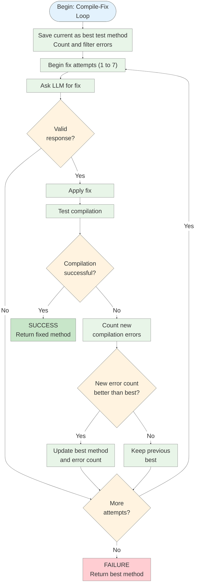

# Compile Fix Loop Flowchart (Concise Version)

This flowchart shows the process for fixing compilation errors in test methods using an iterative LLM-based approach.

## Key Optimizations Made:

1. **Combined Initialization Steps**: Merged "Save original as best", "Count errors", and "Filter errors" into a single initialization step
2. **Simplified LLM Interaction**: Combined "Build prompt" and "Call LLM" into one step
3. **Split Fix Application**: Separated "Apply fix" and "Test compilation" into distinct steps
4. **Added Error Evaluation Granularity**: Split error handling into distinct steps while keeping it compact
5. **Removed Redundant Steps**: Eliminated intermediate steps that don't add significant value to understanding the algorithm

## Preserved Scientific Accuracy:

- **Core Algorithm Logic**: All decision points and control flow remain intact
- **Error Tracking**: The improvement evaluation mechanism is preserved with more granularity
- **Iterative Nature**: The loop structure and attempt counting are maintained
- **Success/Failure Conditions**: Both exit conditions are clearly defined

## Configuration Parameters (Unchanged):

| Parameter    | Default Value | Description                                      |
| ------------ | ------------- | ------------------------------------------------ |
| max_attempts | 7             | Maximum number of fix attempts                   |
| max_examples | 3             | Maximum number of examples to include in prompts |
| Build System | Auto-detected | Maven or Gradle based on project structure       |

This version adds granularity to error evaluation while maintaining compactness (12 nodes total).

### Key Features

- **Progress Tracking**: Tracks error count improvement across attempts
- **Best Method Preservation**: Always keeps the best version seen so far
- **Maven/Gradle Support**: Handles different build system outputs
- **LLM Validation**: Checks for valid responses before compilation
- **Error Filtering**: Extracts relevant compilation errors for Maven projects
